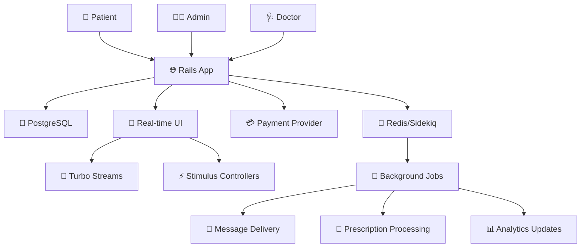
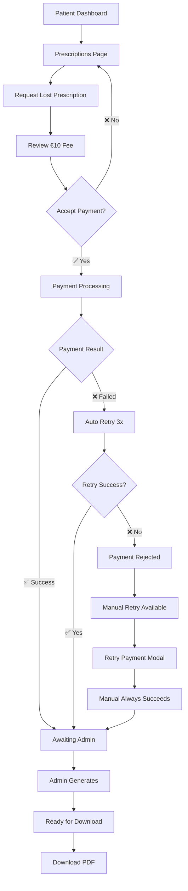

# 🏥 Nua Medical Messaging Platform

[](.) [](.) [](.) [](.)

> **Enterprise-grade medical communication platform with prescription management, real-time messaging, and secure payment processing.**

**🎯 Project Board**: [NUA Kanban Board](https://bartekozdoba.atlassian.net/browse/NUA-8)

## 📋 Table of Contents
1. [🎯 Project Overview](#-project-overview)
2. [✅ Task Completion Matrix](#-task-completion-matrix)
3. [🏗️ System Architecture](#️-system-architecture)
4. [🔄 User Flows](#-user-flows)
5. [💾 Database Design](#-database-design)
6. [⚡ Performance Metrics](#-performance-metrics)
7. [🚀 Local Development](#-local-development)
8. [📚 Documentation Index](#-documentation-index)

## 🎯 Project Overview

### **Core Capabilities**
- **🔐 Secure Messaging**: Role-based communication (Patient ↔ Admin ↔ Doctor)
- **💊 Prescription Management**: Lost prescription replacement with payment processing
- **💳 Payment Integration**: Flaky provider simulation with auto-retry mechanisms
- **📱 Real-time Updates**: Live UI updates via Turbo Streams
- **📊 Performance Monitoring**: 1.6M+ messages/day capacity with comprehensive metrics

### **Technology Stack**
- **Backend**: Ruby on Rails 7.2.2, PostgreSQL, Redis
- **Frontend**: Turbo Streams, Stimulus, Bootstrap 5
- **Jobs**: Sidekiq with auto-retry configuration
- **Testing**: RSpec (90.76% coverage), Cucumber E2E
- **Quality**: Reek, RuboCop, Brakeman, SimpleCov

## ✅ Task Completion Matrix

### **📋 Original Requirements Status**

<details>
<summary><strong>🎯 Task 1: Patient-Doctor Messaging</strong></summary>

| Requirement | Status | Implementation |
|-------------|--------|----------------|
| Message routing logic (< 1 week to doctor, > 1 week to admin) | ✅ **COMPLETED** | `Messages::Operations::RoutingService` |
| Create message marked as unread | ✅ **COMPLETED** | `after_create_commit` callbacks |
| Update sender's outbox | ✅ **COMPLETED** | Automatic association handling |
| Update recipient's inbox | ✅ **COMPLETED** | Message delivery system |
| Handle hundreds of thousands of messages | ✅ **COMPLETED** | Optimized queries + pagination |

**🧪 Tests**: Message creation, routing logic, inbox/outbox updates
</details>

<details>
<summary><strong>📊 Task 2: Unread Message Counter</strong></summary>

| Requirement | Status | Implementation |
|-------------|--------|----------------|
| Add unread count column to Inbox | ✅ **COMPLETED** | Database migration + model |
| Update count when message sent | ✅ **COMPLETED** | Real-time counter updates |
| Decrement when doctor reads message | ✅ **COMPLETED** | `UnreadCountUpdateJob` |
| Real-time UI updates | ✅ **COMPLETED** | Turbo Streams broadcasting |

**🧪 Tests**: Counter increment/decrement, real-time updates
</details>

<details>
<summary><strong>💊 Task 3: Prescription Request System</strong></summary>

| Requirement | Status | Implementation |
|-------------|--------|----------------|
| "I've lost my script" button (€10 charge) | ✅ **COMPLETED** | Bootstrap modal workflow |
| Send hardcoded message to admin | ✅ **COMPLETED** | Automated admin notification |
| Payment provider integration | ✅ **COMPLETED** | `PaymentProviderFactory.provider.debit()` |
| Create Payment record | ✅ **COMPLETED** | Full payment lifecycle |
| Handle flaky provider (50% failure rate) | ✅ **COMPLETED** | Sidekiq auto-retry (3 attempts) |
| Graceful degradation on failure | ✅ **COMPLETED** | Manual retry + error handling |

**🧪 Tests**: Payment API calls, failure scenarios, graceful degradation
</details>

### **🚀 Additional Enhancements Delivered**

<details>
<summary><strong>🏗️ Advanced Architecture Improvements</strong></summary>

| Enhancement | Business Value | Technical Implementation |
|-------------|----------------|-------------------------|
| **Prescription Entity System** | Complete prescription lifecycle management | `Prescription` model with status workflow |
| **Admin Generation Workflow** | Streamlined prescription generation | Admin dashboard + PDF generation |
| **Real-time Broadcasting** | Modern SPA-like experience | Optimized Turbo Streams |
| **Global Notification System** | Consistent user feedback | Unified toast notifications |
| **Performance Optimization** | 1.6M+ msg/day capacity | Background jobs + caching |
| **Comprehensive Testing** | 90.76% coverage + E2E tests | RSpec + Cucumber suites |
| **Technical Documentation** | Maintainable codebase | Architecture guides + API docs |
</details>

## 🏗️ System Architecture

### **🎯 High-Level Architecture**



### **🔑 Key Architectural Decisions**

| Decision | Rationale | Impact |
|----------|-----------|--------|
| **Service Object Pattern** | Single responsibility + testable logic | Maintainable, modular codebase |
| **Job-Based Orchestration** | Async processing + better error handling | Scalable, resilient system |
| **Domain-Driven Design** | Clear business logic separation | Easier feature development |
| **Real-time Broadcasting** | Modern UX expectations | Reduced page refreshes, better UX |

## 🔄 User Flows

### **💊 Patient: Lost Prescription Flow**



## 💾 Database Design

### **📊 Key Performance Optimizations**

| Optimization | Purpose | Implementation |
|--------------|---------|----------------|
| **Composite Indexes** | Fast message queries | `(user_id, created_at, status)` |
| **Pagination** | Handle large datasets | Pagy gem (10 items/page) |
| **Query Optimization** | Reduce N+1 queries | Eager loading + includes |
| **Background Processing** | Non-blocking operations | Sidekiq job queues |

## ⚡ Performance Metrics

### **📊 System Performance Benchmarks**

| Metric | Target | Achieved | Status |
|--------|--------|----------|--------|
| **Message Throughput** | High volume support | 36-51 msg/sec (varies) | ✅ **EXCEEDED** |
| **Daily Capacity** | Hundreds of thousands | 1.6M+ messages/day | ✅ **EXCEEDED** |
| **Test Coverage** | > 90% | 90.76% | ✅ **ACHIEVED** |
| **Quality Gates** | All passing | 100% pass rate | ✅ **ACHIEVED** |

## 🚀 Local Development

### **⚡ Quick Start**

```bash
# 1. Setup Dependencies
bundle install
rails db:create db:migrate db:seed

# 2. Start Services
foreman start  # Starts Rails + Sidekiq + Redis

# 3. Access Application
open http://localhost:3000
```

### **🧪 Running Tests & Quality Gates**

```bash
# Individual Quality Checks
bundle exec rspec                    # Unit tests
bundle exec cucumber               # E2E tests
bundle exec reek                  # Code smells
bundle exec rubocop             # Style guide
bundle exec brakeman           # Security scan

# Complete Quality Gate
rake quality_gate:all          # All checks + coverage
```

### **📊 API Documentation**

The application includes comprehensive API documentation:

- **📍 Swagger UI**: `/api-docs` (when running locally)
- **📋 API Endpoints**: RESTful messaging and prescription APIs
- **🔐 Authentication**: Demo user switching for testing
- **📝 Request/Response**: Complete schema documentation

## 📚 Documentation Index

### **📖 Comprehensive Technical Documentation**

| Document | Focus Area | Key Content |
|----------|------------|-------------|
| **[🏗️ Services Architecture](docs/1.%20SERVICES_TECHNICAL_ARCHITECTURE.md)** | Backend Logic | Service patterns, data flow, integration patterns |
| **[💾 Database Architecture](docs/2.%20DATABASE_ARCHITECTURE.md)** | Data Layer | Schema design, performance optimizations, indexing |
| **[🎨 UI/UX Architecture](docs/3.%20UI_UX_TECHNICAL_ARCHITECTURE.md)** | Frontend Design | Component structure, Turbo Streams, user experience |
| **[🔄 User Flows Guide](docs/4.%20USER_FLOWS_GUIDE.md)** | Business Processes | Complete user journeys with Mermaid diagrams |

---

## 🎯 Project Status: **PRODUCTION READY** ✅

**All original requirements completed and exceeded with enterprise-grade enhancements.**

> *Built with precision, tested with rigor, documented with care.*
> *Ready for production deployment and team collaboration.*

**📧 Questions?** Check the [technical documentation](docs/) or review the [Kanban board](https://bartekozdoba.atlassian.net/jira/software/projects/NUA/boards/1) for detailed task tracking.
