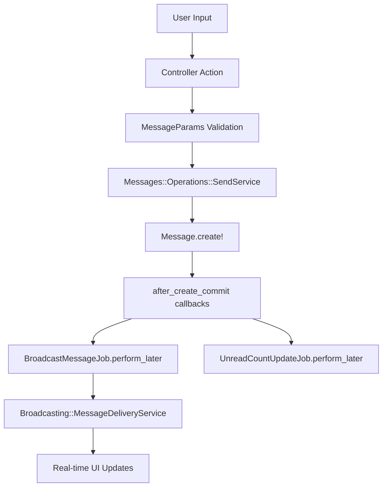
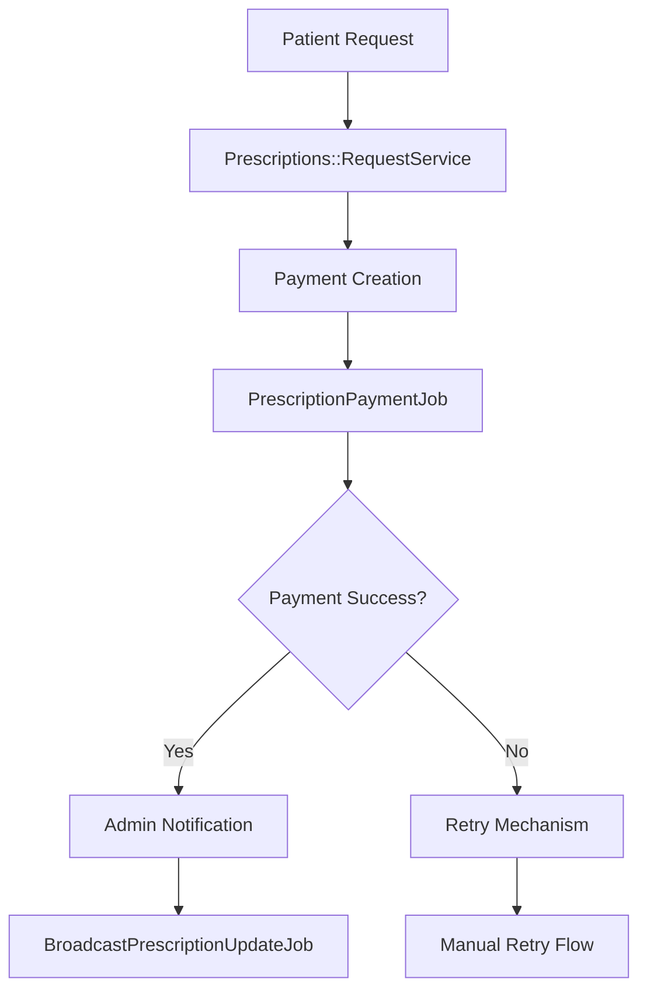
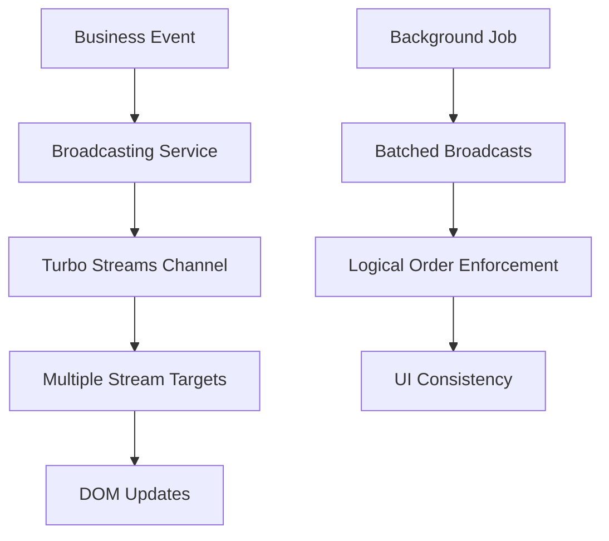

# 🏗️ Services Technical Architecture Guide

## 📋 Table of Contents
1. [Service Layer Organization](#service-layer-organization)
2. [Data Flow & Process Architecture](#data-flow--process-architecture)
3. [Background Jobs Architecture](#background-jobs-architecture)
4. [Value Objects & Data Structures](#value-objects--data-structures)
5. [Error Handling & Resilience](#error-handling--resilience)
6. [Performance & Optimization Patterns](#performance--optimization-patterns)
7. [Integration Patterns](#integration-patterns)

---

## 🏛️ Service Layer Organization

### **Service Hierarchy Structure**
```
app/services/
├── api/                      # API Infrastructure Services
├── broadcasting/             # Real-time Communication Services
├── caching/                 # Performance Optimization Services
├── inboxes/                 # Inbox Management Services
├── messages/                # Core Message Business Logic
├── payments/                # Payment Processing Services
├── performance/             # System Performance Services
└── prescriptions/           # Prescription Workflow Services
```

### **Service Design Patterns**

#### **1. Domain-Driven Design (DDD) Structure**
```ruby
# Domain Organization
Messages::
├── Operations::         # Core business operations
├── Conversations::      # Conversation management
├── Participants::       # User/participant logic
├── Queries::           # Data querying services
├── Presentation::      # Response formatting
└── Caching::          # Domain-specific caching
```

#### **2. Service Responsibility Patterns**

| Pattern | Purpose | Example |
|---------|---------|---------|
| **Orchestrator** | Coordinates multiple services | `Messages::Conversations::OrchestratorService` |
| **Operation** | Single business operation | `Messages::Operations::SendService` |
| **Data Provider** | Data aggregation/formatting | `Messages::Conversations::DataService` |
| **Infrastructure** | Technical concerns | `Broadcasting::TurboStreamsService` |

### **Service Interface Contracts**

#### **Standard Service Interface**
```ruby
class ServiceTemplate
  def initialize(dependencies)
    # Dependency injection
  end

  def call
    # Main operation
    # Returns: Api::ResponseResult
  end

  private

  # Internal methods
end
```

#### **Response Pattern**
```ruby
# Success Response
Api::ResponseResult.success(data, message: "Success message")

# Failure Response
Api::ResponseResult.failure("Error message", details: ["detail1", "detail2"])
```

---

## 🔄 Data Flow & Process Architecture

### **Core Business Processes**

#### **1. Message Creation Flow (Actual Implementation)**


**Actual Service Chain (Real Code):**
1. **Controller** → `MessageParams.new(params)` → validation
2. **SendService** → `RoutingService.determine_recipient` 
3. **SendService** → `Message.create!(attributes)`
4. **Message Model** → `after_create_commit :enqueue_broadcast_message`
5. **BroadcastMessageJob** → `Broadcasting::MessageDeliveryService.broadcast_new_message`
6. **MessageDeliveryService** → Multiple Turbo Stream updates

#### **2. Prescription Request Flow**


**Service Chain:**
1. **RequestService** → Payment + Prescription creation
2. **PrescriptionPaymentJob** → Async payment processing
3. **Success Path** → Admin notification + patient updates
4. **Failure Path** → Retry mechanism activation

#### **3. Real-time Broadcasting Flow**


### **Service Interaction Patterns**

#### **1. Orchestration Pattern**
```ruby
# Coordinate multiple services
class OrchestratorService
  def conversation
    @conversation ||= ConversationDataService.new(message)
  end

  def participants
    @participants ||= ParticipantsDataService.new(conversation.messages)
  end

  def method_missing(method, *, &)
    # Delegate to appropriate service
    route_to_service(method, *, &)
  end
end
```

#### **2. Pipeline Pattern**
```ruby
# Sequential service execution
class SendService
  def call
    build_message
    recipient = find_recipient
    return failure unless recipient

    deliver_message(recipient)
  end
end
```

#### **3. Factory Pattern**
```ruby
# Dynamic service creation
class PaymentProviderFactory
  def self.create_provider(type = :flaky)
    case type
    when :flaky
      Payments::FlakyPaymentProvider.new
    when :stripe
      Payments::StripeProvider.new
    end
  end
end
```

---

## ⚙️ Background Jobs Architecture

### **Job Queue Strategy**

#### **Priority-Based Queue System**
```ruby
# Queue Priorities
:high_priority   # User-facing operations (messages, prescriptions)
:default         # Standard background tasks
:low_priority    # Cache warming, cleanup
```

#### **Job Categories & Responsibilities**

| Job Type | Queue | Purpose | Retry Strategy |
|----------|-------|---------|---------------|
| **MessageCreationJob** | high_priority | Message creation & routing | 3 attempts, 10s wait |
| **PrescriptionPaymentJob** | high_priority | Payment processing | 3 attempts, 10s wait |
| **BroadcastUpdateJob** | high_priority | Real-time UI updates | 2 attempts, 5s wait |
| **UnreadCountUpdateJob** | default | Counter maintenance | 2 attempts, no wait |
| **CacheWarmingJob** | low_priority | Performance optimization | 1 attempt |

### **Job Design Patterns**

#### **1. Batched Broadcasting Pattern**
```ruby
# app/jobs/broadcast_prescription_update_job.rb (ACTUAL CODE)
class BroadcastPrescriptionUpdateJob < ApplicationJob
  queue_as :high_priority

  def perform(prescription_id, notification_message = nil, wait_for_message_creation: false)
    prescription = Prescription.find_by(id: prescription_id)
    return unless prescription&.user

    Rails.logger.info "Broadcasting prescription update #{prescription_id} in background"

    # If we need to wait for message creation (e.g., prescription ready message)
    if wait_for_message_creation
      # Small delay to ensure message creation job completes first
      sleep(0.5)
      Rails.logger.info "Waited for message creation before broadcasting prescription #{prescription_id}"
    end

    # Batch all prescription-related broadcasts in LOGICAL ORDER
    user = prescription.user

    # 1. FIRST: Update prescription item in patient list (most important)
    broadcast_prescription_item_update(prescription)

    # 2. SECOND: Update action button and badge in admin conversation view (admin visibility)
    broadcast_prescription_action_button_update(prescription)

    # 3. THIRD: Update prescription count badge (auxiliary info)
    broadcast_prescription_count_update(user)

    # 4. FOURTH: Show notification if provided (last, so user sees updated state)
    broadcast_notification(user, notification_message) if notification_message

    # 5. FINALLY: Enqueue pagination update (after all content updates)
    Broadcasting::PaginationUpdatesService.enqueue_prescription_pagination_update(user)

    Rails.logger.info "Successfully broadcast prescription update #{prescription_id} in logical order"
  rescue StandardError => e
    Rails.logger.error "Failed to broadcast prescription update #{prescription_id}: #{e.message}"
    raise e
  end
end
```

#### **2. Resilient Processing Pattern**
```ruby
class PrescriptionPaymentJob < ApplicationJob
  # Sidekiq retry configuration
  retry_on Payments::FlakyPaymentProvider::PaymentError,
           wait: 10.seconds,
           attempts: 3

  discard_on StandardError do |job, error|
    # Handle final failure after all retries
    handle_payment_failure(payment, error.message)
  end
end
```

#### **3. Coordinated Jobs Pattern**
```ruby
# Ensures proper execution order
class MessageCreationJob
  def perform(attributes, user_id)
    result = create_message(attributes, user_id)

    if result.success?
      # Trigger dependent jobs AFTER message creation
      BroadcastMessageJob.perform_later(result.data.id)
      UnreadCountUpdateJob.perform_later(inbox.id, 'increment')
    end
  end
end
```

### **Job Monitoring & Observability**

#### **Logging Strategy**
```ruby
# Structured logging for job tracking
Rails.logger.info "Creating message in background for user #{user_id}"
Rails.logger.info "Successfully created message #{message.id} in background"
Rails.logger.error "Failed to create message: #{error_message}"
```

#### **Error Handling Strategy**
```ruby
# Graceful degradation
rescue StandardError => e
  Rails.logger.error "Job failed: #{e.message}"

  # Notify user of failure (optional)
  broadcast_error_notification(user, e.message)

  # Re-raise for retry mechanism
  raise e unless e.is_a?(NonRetryableError)
end
```

---

## 💎 Value Objects & Data Structures

### **Value Object Architecture**

#### **Purpose & Benefits**
- **Immutability**: Prevents accidental state changes
- **Validation**: Encapsulates business rules
- **Type Safety**: Compile-time error prevention
- **Domain Modeling**: Rich domain expressions

### **Core Value Objects**

#### **1. MessageParams**
```ruby
class MessageParams
  include ActiveModel::Model
  include ActiveModel::Validations

  # Attributes
  attr_accessor :body, :routing_type, :parent_message_id, :status

  # Validations
  validates :body, presence: true, length: { minimum: 1, maximum: 500 }
  validates :routing_type, inclusion: { in: Message.routing_types.keys }

  # Interface
  def to_message_attributes
    { body: body, routing_type: routing_type, parent_message_id: parent_message_id }.compact
  end
end
```

#### **2. MessageRoutingType**
```ruby
class MessageRoutingType
  DIRECT = 'direct'    # New conversation
  REPLY = 'reply'      # Thread response
  AUTO = 'auto'        # System-routed

  def initialize(routing_type)
    @routing_type = routing_type.to_s
    validate_routing_type!
    freeze # Immutability
  end

  # Factory methods
  def self.direct; new(DIRECT); end
  def self.reply; new(REPLY); end
  def self.auto; new(AUTO); end

  # Predicate methods
  def direct?; routing_type == DIRECT; end
  def reply?; routing_type == REPLY; end
  def auto?; routing_type == AUTO; end
end
```

#### **3. Api::ResponseResult**
```ruby
class Api::ResponseResult
  attr_reader :success, :data, :error_message, :error_details

  def self.success(data = nil, message: nil)
    new(success: true, data: data, message: message)
  end

  def self.failure(error_message, details: [])
    new(success: false, error_message: error_message, error_details: details)
  end

  def success?; @success; end
  def failure?; !@success; end
end
```

### **Data Structure Patterns**

#### **1. Parameter Objects**
```ruby
# Encapsulate complex parameter sets
message_params = MessageParams.new(request.params)
return render_error(message_params.errors) unless message_params.valid?

service = Messages::Operations::SendService.new(message_params, current_user)
```

#### **2. Result Objects**
```ruby
# Standardized operation results
result = service.call

if result.success?
  render json: { data: result.data, message: result.message }
else
  render json: { error: result.error_message, details: result.error_details }
end
```

#### **3. Domain Enums**
```ruby
# Type-safe domain values
routing_type = MessageRoutingType.determine_for_message(message)

case routing_type
when MessageRoutingType.direct
  # Handle new conversation
when MessageRoutingType.reply
  # Handle threaded response
end
```

---

## 🛡️ Error Handling & Resilience

### **Error Handling Hierarchy**

#### **1. Domain-Specific Exceptions**
```ruby
module Messages::Operations
  class RoutingService
    # Custom domain exceptions
    class NoDoctorAvailableError < StandardError; end
    class NoAdminAvailableError < StandardError; end
    class UnsupportedUserRoleError < StandardError; end
  end
end
```

#### **2. Service-Level Error Handling**
```ruby
class SendService
  def call
    # Business logic
  rescue RoutingService::NoDoctorAvailableError => e
    Api::ResponseResult.failure('No doctors available', details: [e.message])
  rescue StandardError => e
    Rails.logger.error "Unexpected error: #{e.message}"
    Api::ResponseResult.failure('Service temporarily unavailable')
  end
end
```

#### **3. Job-Level Resilience**
```ruby
class PrescriptionPaymentJob
  # Automatic retry with exponential backoff
  retry_on Payments::FlakyPaymentProvider::PaymentError,
           wait: 10.seconds,
           attempts: 3

  # Final failure handling
  discard_on StandardError do |job, error|
    payment = Payment.find(job.arguments.first)
    handle_payment_failure(payment, error.message)
  end
end
```

### **Resilience Patterns**

#### **1. Circuit Breaker Pattern**
```ruby
class PaymentProviderWrapper
  def self.process_payment(amount, payment_id)
    if circuit_open?
      raise PaymentError, 'Payment service unavailable'
    end

    begin
      provider.debit(amount, payment_id: payment_id)
      reset_failure_count
    rescue PaymentError => e
      increment_failure_count
      raise e
    end
  end
end
```

#### **2. Graceful Degradation**
```ruby
class MessageDeliveryService
  def broadcast_new_message
    # Critical operations (always attempted)
    broadcast_to_recipient_inbox
    broadcast_to_sender_outbox

    # Non-critical operations (fail gracefully)
    safely_broadcast_to_conversation_thread
    safely_update_pagination
  end

  private

  def safely_broadcast_to_conversation_thread
    broadcast_to_conversation_thread
  rescue StandardError => e
    Rails.logger.warn "Non-critical broadcast failed: #{e.message}"
  end
end
```

#### **3. Compensation Pattern**
```ruby
class PrescriptionRequestService
  def call
    payment = create_payment
    prescription = create_prescription(payment)

    begin
      enqueue_payment_processing(payment)
    rescue StandardError => e
      # Compensate for partial failure
      cleanup_failed_request(payment, prescription)
      raise e
    end
  end
end
```

---

## ⚡ Performance & Optimization Patterns

### **Caching Architecture**

#### **1. Service-Level Caching**
```ruby
module Caching
  class UnreadCountService
    CACHE_TTL = 5.minutes

    def self.get_count(inbox_id)
      Rails.cache.fetch("inbox:#{inbox_id}:unread_count", expires_in: CACHE_TTL) do
        calculate_unread_count(inbox_id)
      end
    end

    def self.invalidate_count(inbox_id)
      Rails.cache.delete("inbox:#{inbox_id}:unread_count")
    end
  end
end
```

#### **2. Cache Warming Strategy**
```ruby
class CacheWarmingJob < ApplicationJob
  queue_as :low_priority

  def perform(warming_type = :unread_counts)
    case warming_type.to_sym
    when :unread_counts
      warm_unread_counts_for_active_users
    when :conversations
      warm_conversation_caches_for_recent_activity
    end
  end
end
```

#### **3. Cache Invalidation Patterns**
```ruby
module Messages::Caching
  class InvalidationService
    def self.invalidate_for_message(message)
      # Invalidate related caches
      invalidate_conversation_cache(message.conversation_root)
      invalidate_unread_count_cache(message.inbox)
      invalidate_message_list_cache(message.outbox.user)
    end
  end
end
```

### **Database Optimization**

#### **1. Query Optimization Service**
```ruby
class Messages::Queries::DataService
  def conversation_messages_with_preloading
    Message.includes(:outbox, :inbox, outbox: :user, inbox: :user)
           .where(id: conversation_message_ids)
           .order(:created_at)
  end

  def optimized_unread_count
    # Use counter cache or raw SQL for performance
    inbox.messages.unread.count
  end
end
```

#### **2. Background Processing Optimization**
```ruby
class BroadcastPrescriptionUpdateJob
  def perform(prescription_id, notification = nil, wait_for_message: false)
    # Batch database queries
    prescription = Prescription.includes(:user, :payment, messages: [:outbox, :inbox])
                              .find(prescription_id)

    # Minimize broadcast calls
    batch_broadcast_updates(prescription, notification)
  end
end
```

### **Concurrent Processing**

#### **1. Parallel Service Execution**
```ruby
module Performance
  class ConcurrentExecutionService
    def self.execute_parallel(*services)
      futures = services.map do |service|
        Concurrent::Future.execute { service.call }
      end

      futures.map(&:value)
    end
  end
end
```

#### **2. Async Job Coordination**
```ruby
class MessageProcessingCoordinator
  def process_message_batch(messages)
    # Process messages concurrently
    jobs = messages.map do |message|
      MessageCreationJob.perform_later(message.attributes, message.user.id)
    end

    # Optional: Wait for completion
    jobs.each(&:wait) if synchronous_mode?
  end
end
```

---

## 🔌 Integration Patterns

### **Current Architecture: Job-Based Orchestration vs Event-Driven**

#### **What We Actually Use:**
- **Job Chains**: Jobs trigger other jobs in logical sequence
- **Direct Service Calls**: Services call other services synchronously  
- **Callback-Based Broadcasting**: Model callbacks trigger background jobs
- **Coordinated Timing**: Jobs wait for each other using sleep/delays

#### **What We DON'T Use:**
- **Domain Events**: No event publishing/subscribing system
- **Event Bus**: No centralized event routing
- **Event Sourcing**: No event store or replay capability
- **Saga Pattern**: No complex transaction orchestration

#### **Why Job-Based Works Well:**
- **Simplicity**: Easier to understand and debug
- **Rails Native**: Leverages ActiveJob and Sidekiq
- **Performance**: Background processing without event overhead
- **Reliability**: Built-in retry and error handling

### **External Service Integration**

#### **1. Provider Pattern**
```ruby
module Payments
  class PaymentProviderFactory
    def self.create_provider(type = Rails.application.config.payment_provider)
      case type.to_sym
      when :flaky
        FlakyPaymentProvider.new
      when :stripe
        StripePaymentProvider.new
      when :mock
        MockPaymentProvider.new
      else
        raise ArgumentError, "Unknown payment provider: #{type}"
      end
    end
  end
end
```

#### **2. Adapter Pattern**
```ruby
class PaymentAdapter
  def initialize(provider)
    @provider = provider
  end

  def process_payment(amount, payment_id:)
    # Normalize provider interface
    result = @provider.debit(amount, payment_id: payment_id)

    # Standardize response
    PaymentResult.new(success: result, provider: @provider.class.name)
  end
end
```

#### **3. Service Abstraction**
```ruby
module Api
  class AuthenticationService
    def self.authenticate(request)
      # Abstract authentication logic
      # Can switch between JWT, session, API key, etc.
      case Rails.application.config.auth_strategy
      when :session
        authenticate_via_session(request)
      when :jwt
        authenticate_via_jwt(request)
      end
    end
  end
end
```

### **Current Implementation: Model Callbacks → Background Jobs Pattern**

#### **1. Model Callbacks Trigger Jobs (Real Code)**
```ruby
# app/models/message.rb
class Message < ApplicationRecord
  # == Callbacks ==
  # Use background jobs for broadcasting to improve performance
  after_create_commit :enqueue_broadcast_message
  after_update_commit :enqueue_broadcast_update

  # Unread count management (async for performance)
  after_create_commit :enqueue_increment_inbox_unread_count
  after_update_commit :enqueue_handle_read_status_change, if: :saved_change_to_read?

  # Cache invalidation (selective - only when necessary)
  after_commit :invalidate_conversation_caches, on: [:create, :update], if: :should_invalidate_caches?
  
  private
  
  def enqueue_broadcast_message
    BroadcastMessageJob.perform_later(id)
  end
  
  def enqueue_increment_inbox_unread_count
    return unless inbox&.id
    UnreadCountUpdateJob.perform_later(inbox.id, 'increment')
  end
end
```

#### **2. Actual Job Implementation with Coordinated Flow**
```ruby
# app/jobs/prescription_payment_job.rb (REAL CODE)
class PrescriptionPaymentJob < ApplicationJob
  retry_on Payments::FlakyPaymentProvider::PaymentError,
           wait: 10.seconds, attempts: 3
           
  def handle_payment_success(payment)
    payment.mark_completed!
    prescription = payment.prescription
    return unless prescription
    
    prescription.update!(status: :requested)

    # LOGICAL ORDER: First send admin notification, THEN broadcast to patient
    # 1. FIRST: Send message to admin about successful payment (creates message)
    notify_admin_of_prescription_request(prescription)

    # 2. SECOND: Broadcast success to patient AFTER admin notification with wait
    broadcast_payment_success(prescription, wait_for_message: true)
  end
  
  def notify_admin_of_prescription_request(prescription)
    admin = User.admin.first
    return unless admin

    message_body = "Prescription request from #{prescription.user.full_name}. " \
                   "Payment confirmed (€#{prescription.payment.amount}). " \
                   'Please generate and send prescription.'

    # Create message directly to admin inbox with prescription relationship
    message = Message.create!(
      body: message_body,
      status: :sent,
      routing_type: :direct,
      prescription: prescription,
      outbox: prescription.user.outbox,  # From patient
      inbox: admin.inbox                 # Directly to admin
    )

    # Broadcast new message to admin's inbox
    Broadcasting::MessageDeliveryService.broadcast_new_message(message)
  end
end
```

#### **3. Service Layer Calls Jobs (Real Code)**
```ruby
# app/services/broadcasting/prescription_updates_service.rb (REAL CODE)
class Broadcasting::PrescriptionUpdatesService
  def self.broadcast_status_update(prescription, notification_message = nil, wait_for_message: false)
    return unless prescription&.user

    # Enqueue background job for optimal performance with logical ordering
    BroadcastPrescriptionUpdateJob.perform_later(
      prescription.id,
      notification_message,
      wait_for_message_creation: wait_for_message
    )
  end
end
```

### **API Integration Patterns**

#### **1. Response Standardization**
```ruby
module Api
  class ResponseService
    def self.success(data = nil, message: nil, meta: {})
      {
        success: true,
        data: data,
        message: message,
        meta: meta,
        timestamp: Time.current.iso8601
      }
    end

    def self.error(message, details: [], code: nil)
      {
        success: false,
        error: {
          message: message,
          details: details,
          code: code
        },
        timestamp: Time.current.iso8601
      }
    end
  end
end
```

#### **2. Exception Handling Middleware**
```ruby
module Api
  class ExceptionHandler
    def self.handle(exception, context)
      case exception
      when ActiveRecord::RecordNotFound
        ResponseService.error('Resource not found', code: 'RESOURCE_NOT_FOUND')
      when ValidationError
        ResponseService.error('Validation failed', details: exception.details)
      else
        ResponseService.error('Internal server error', code: 'INTERNAL_ERROR')
      end
    end
  end
end
```

---

## 🎯 Architecture Principles & Best Practices

### **Design Principles**

#### **1. Single Responsibility Principle**
- Each service has one clear purpose
- Services are small and focused
- Easy to test and maintain

#### **2. Dependency Injection**
- Services receive dependencies via constructor
- Makes testing easier with mocks
- Promotes loose coupling

#### **3. Interface Segregation**
- Small, focused service interfaces
- Clients depend only on methods they use
- Promotes modularity

#### **4. Command-Query Separation**
- Clear distinction between actions and queries
- Commands change state, queries don't
- Improves reasoning about side effects

### **Performance Guidelines**

#### **1. Async-First Philosophy**
- Use background jobs for non-critical operations
- Minimize blocking operations in request cycle
- Batch related operations together

#### **2. Caching Strategy**
- Cache expensive computations
- Use appropriate cache TTLs
- Implement cache invalidation patterns

#### **3. Database Optimization**
- Use appropriate indexes
- Minimize N+1 queries with includes
- Use counter caches for aggregations

### **Maintainability Guidelines**

#### **1. Error Handling**
- Fail fast with clear error messages
- Use domain-specific exceptions
- Implement graceful degradation

#### **2. Logging & Monitoring**
- Structured logging for observability
- Monitor key business metrics
- Track service performance

#### **3. Testing Strategy**
- Unit tests for service logic
- Integration tests for workflows
- End-to-end tests for critical paths

---

*This architecture provides a robust, scalable, and maintainable foundation for complex business workflows with excellent separation of concerns and performance characteristics.*
