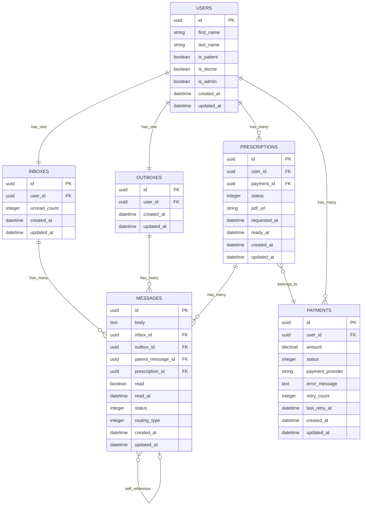
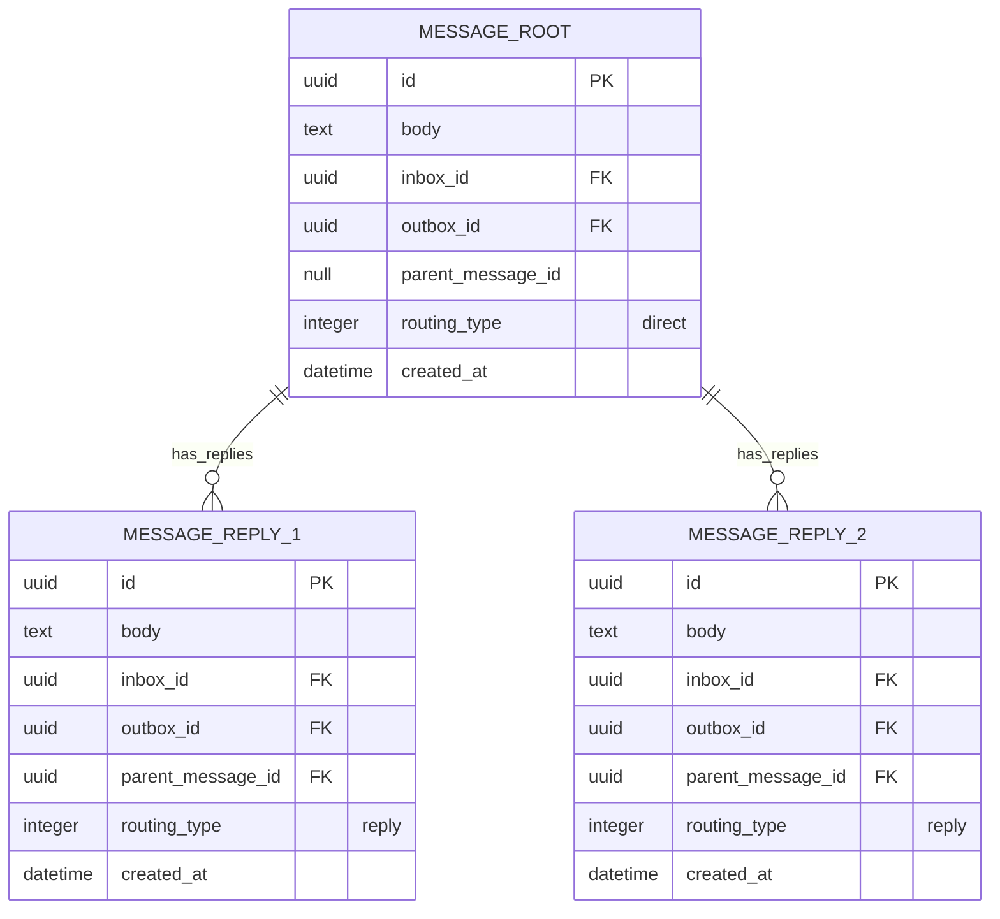
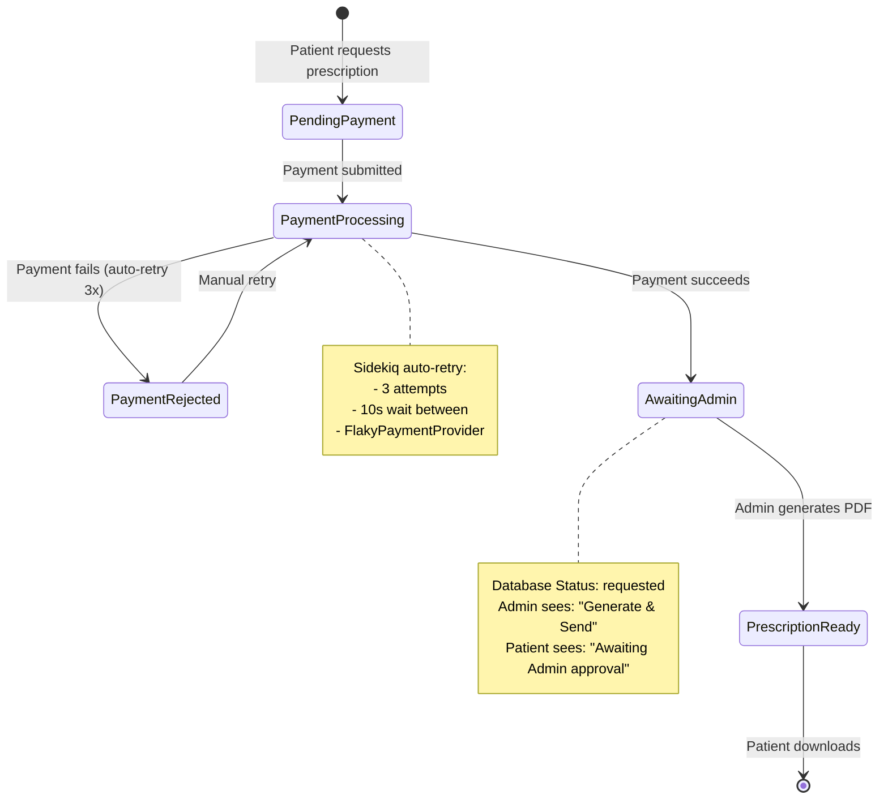

# 🗄️ Database Architecture Guide

## 📋 Table of Contents
1. [Database Schema Overview](#database-schema-overview)
2. [Entity Relationship Diagrams](#entity-relationship-diagrams)
3. [Table Structures & Relationships](#table-structures--relationships)
4. [PostgreSQL vs SQLite Decision](#postgresql-vs-sqlite-decision)
5. [Performance Optimizations](#performance-optimizations)
6. [Index Strategy](#index-strategy)
7. [Query Patterns & Performance](#query-patterns--performance)

---

## 🎯 Database Schema Overview

### **Technology Stack**
- **Database Engine**: PostgreSQL 14+
- **UUID Primary Keys**: All tables use UUID for security and distributed systems
- **Extensions**: `pgcrypto`, `plpgsql`
- **Connection Pool**: 15 connections (optimized for Sidekiq concurrency)

### **Schema Statistics**
- **6 Core Tables**: Users, Messages, Inboxes, Outboxes, Prescriptions, Payments
- **25+ Performance Indexes**: Optimized for messaging and prescription workflows
- **3 Key Relationships**: User ↔ Messages, Messages ↔ Prescriptions, Prescriptions ↔ Payments
- **Foreign Key Constraints**: Ensures data integrity with cascade options

---

## 📊 Entity Relationship Diagrams

### **Core Data Model**


### **Message Threading & Conversation Flow**


### **Prescription Workflow State Machine**


---

## 🏗️ Table Structures & Relationships

### **1. Users Table (Identity Management)**
```sql
-- app/models/user.rb (Schema Information)
CREATE TABLE users (
    id UUID PRIMARY KEY DEFAULT gen_random_uuid(),
    first_name VARCHAR,
    last_name VARCHAR,
    is_patient BOOLEAN DEFAULT true NOT NULL,
    is_doctor BOOLEAN DEFAULT false NOT NULL,
    is_admin BOOLEAN DEFAULT false NOT NULL,
    created_at TIMESTAMP NOT NULL,
    updated_at TIMESTAMP NOT NULL
);
```

**Design Decisions:**
- **UUID Primary Keys**: Security & distributed systems
- **Role Flags**: Simple boolean flags vs complex role table
- **Automatic Inbox/Outbox**: Created via `after_create` callback

**Relationships:**
```ruby
# app/models/user.rb (Real Code)
has_one :inbox, dependent: :destroy
has_one :outbox, dependent: :destroy
has_many :payments, dependent: :destroy
has_many :prescriptions, dependent: :destroy
has_many :inbox_messages, through: :inbox, source: :messages
has_many :outbox_messages, through: :outbox, source: :messages
```

### **2. Messages Table (Core Communication)**
```sql
-- Generated from db/schema.rb (Real Schema)
CREATE TABLE messages (
    id UUID PRIMARY KEY DEFAULT gen_random_uuid(),
    body TEXT,
    inbox_id UUID,
    outbox_id UUID,
    parent_message_id UUID,
    prescription_id UUID,
    read BOOLEAN DEFAULT false NOT NULL,
    read_at TIMESTAMP,
    status INTEGER DEFAULT 0 NOT NULL,
    routing_type INTEGER DEFAULT 0 NOT NULL,
    created_at TIMESTAMP NOT NULL,
    updated_at TIMESTAMP NOT NULL
);
```

**Key Features:**
- **Self-Referencing**: `parent_message_id` for conversation threading
- **Dual Routing**: Both `inbox_id` and `outbox_id` for clarity
- **Prescription Link**: Direct relationship for performance
- **Enum Fields**: `status` (sent/delivered/read), `routing_type` (direct/reply/auto)

**Performance Indexes (Real Implementation):**
```sql
-- From db/schema.rb (Actual Indexes)
CREATE INDEX idx_messages_inbox_created_at ON messages (inbox_id, created_at DESC);
CREATE INDEX idx_messages_inbox_unread_created ON messages (inbox_id, read, created_at DESC);
CREATE INDEX idx_messages_inbox_prescription_created ON messages (inbox_id, prescription_id, created_at);
CREATE INDEX idx_messages_parent_thread ON messages (parent_message_id, created_at DESC);
CREATE INDEX idx_messages_root_conversations ON messages (parent_message_id, created_at DESC)
    WHERE parent_message_id IS NULL;
```

### **3. Prescriptions Table (Business Logic Core)**
```sql
-- From db/schema.rb (Real Schema)
CREATE TABLE prescriptions (
    id UUID PRIMARY KEY DEFAULT gen_random_uuid(),
    user_id UUID NOT NULL,
    payment_id UUID,
    status INTEGER DEFAULT 0 NOT NULL,
    pdf_url VARCHAR,
    requested_at TIMESTAMP NOT NULL,
    ready_at TIMESTAMP,
    created_at TIMESTAMP NOT NULL,
    updated_at TIMESTAMP NOT NULL
);
```

**Status Enum (Real Implementation):**
```ruby
# app/models/prescription.rb (Actual Code)
enum :status, {
    requested: 0,        # Payment successful, awaiting admin
    payment_rejected: 1, # Payment failed, retry available
    ready: 2            # PDF generated, ready for download
}
```

**Performance Indexes:**
```sql
-- Optimized for common queries
CREATE INDEX idx_prescriptions_user_status_created ON prescriptions (user_id, status, created_at);
CREATE INDEX index_prescriptions_on_user_id_and_status ON prescriptions (user_id, status);
```

### **4. Payments Table (Financial Transactions)**
```sql
-- From db/schema.rb (Real Schema)
CREATE TABLE payments (
    id UUID PRIMARY KEY DEFAULT gen_random_uuid(),
    user_id UUID,
    amount DECIMAL(8,2) DEFAULT 0.0 NOT NULL,
    status INTEGER DEFAULT 0 NOT NULL,
    payment_provider VARCHAR DEFAULT 'flaky' NOT NULL,
    error_message TEXT,
    retry_count INTEGER DEFAULT 0 NOT NULL,
    last_retry_at TIMESTAMP,
    created_at TIMESTAMP NOT NULL,
    updated_at TIMESTAMP NOT NULL
);
```

**Retry Logic Indexes:**
```sql
-- Optimized for payment retry workflows
CREATE INDEX idx_payments_status_retry_created ON payments (status, retry_count, created_at);
CREATE INDEX idx_payments_user_status_created ON payments (user_id, status, created_at);
```

---

## 🚀 PostgreSQL vs SQLite Decision

### **Why PostgreSQL Over SQLite**

#### **Concurrency Requirements**
```ruby
# config/database.yml (Real Configuration)
default: &default
  adapter: postgresql
  pool: <%= ENV.fetch("RAILS_MAX_THREADS") { 15 } %>  # Concurrency support
  timeout: 5000

  variables:
    statement_timeout: 30000        # 30s query timeout
    lock_timeout: 10000            # 10s lock timeout
    idle_in_transaction_session_timeout: 60000  # 60s idle timeout
```

#### **Feature Comparison**

| Feature | PostgreSQL | SQLite | Our Requirement |
|---------|------------|--------|-----------------|
| **Concurrent Writes** | ✅ Multiple | ❌ Single | ✅ **Critical** (Sidekiq jobs) |
| **UUID Support** | ✅ Native | ❌ Extensions | ✅ **Required** (Security) |
| **Advanced Indexes** | ✅ Partial, Composite | ⚠️ Limited | ✅ **Required** (Performance) |
| **JSON Queries** | ✅ Optimized | ⚠️ Basic | ✅ **Future** (Meta fields) |
| **Connection Pooling** | ✅ PgBouncer | ❌ File locks | ✅ **Required** (15 threads) |
| **Full-Text Search** | ✅ Built-in | ❌ FTS extension | ✅ **Future** (Message search) |

#### **Real-World Usage Patterns**

```ruby
# Concurrent operations that require PostgreSQL
class MessageCreationJob < ApplicationJob
  def perform(message_attributes, user_id)
    # Multiple jobs writing simultaneously
    # SQLite would serialize these operations
    ActiveRecord::Base.transaction do
      message = Message.create!(message_attributes)
      inbox.increment!(:unread_count)  # Atomic counter update
      # ... more concurrent operations
    end
  end
end
```

### **PostgreSQL Extensions Used**

#### **1. pgcrypto Extension**
```sql
-- From db/schema.rb
enable_extension "pgcrypto"

-- Enables UUID generation
id: :uuid, default: -> { "gen_random_uuid()" }
```

#### **2. Performance Optimizations**
```sql
-- PostgreSQL-specific optimizations
CREATE INDEX CONCURRENTLY idx_messages_inbox_unread
    ON messages (inbox_id, read_at)
    WHERE read_at IS NULL;  -- Partial index for unread messages
```

---

## ⚡ Performance Optimizations

### **Index Strategy (Real Implementation)**

#### **1. Query-Driven Index Design**
```sql
-- Inbox message list (most common query)
SELECT * FROM messages
WHERE inbox_id = ?
ORDER BY created_at DESC
LIMIT 10;

-- Supporting index (actual implementation)
CREATE INDEX idx_messages_inbox_created_at
    ON messages (inbox_id, created_at DESC);
```

#### **2. Unread Count Optimization**
```sql
-- Counter cache vs COUNT query
-- Before: SELECT COUNT(*) FROM messages WHERE inbox_id = ? AND read = false
-- After: SELECT unread_count FROM inboxes WHERE id = ?

-- Supporting indexes
CREATE INDEX idx_inboxes_unread_count ON inboxes (unread_count);
CREATE INDEX idx_messages_inbox_read_status ON messages (inbox_id, read)
    WHERE read = false;  -- Partial index
```

#### **3. Conversation Threading**
```sql
-- Conversation thread loading
SELECT * FROM messages
WHERE parent_message_id = ? OR id = ?
ORDER BY created_at ASC;

-- Supporting indexes
CREATE INDEX idx_messages_parent_thread
    ON messages (parent_message_id, created_at DESC);
CREATE INDEX idx_messages_root_conversations
    ON messages (parent_message_id, created_at DESC)
    WHERE parent_message_id IS NULL;  -- Root messages only
```

### **Database Connection Optimization**

#### **Connection Pool Configuration**
```yaml
# config/database.yml (Real Configuration)
default: &default
  adapter: postgresql
  pool: 15                    # Matches Sidekiq concurrency
  timeout: 5000              # 5s connection timeout
  variables:
    statement_timeout: 30000  # Prevent runaway queries
    lock_timeout: 10000      # Prevent deadlocks
```

#### **Query Performance Monitoring**
```ruby
# Real implementation for slow query detection
class ApplicationRecord < ActiveRecord::Base
  self.implicit_order_column = 'created_at'  # Default ordering

  # UUID generation optimization
  before_create :generate_uuid, if: :uuid_primary_key?

  private

  def generate_uuid
    self.id = SecureRandom.uuid if id.blank?
  end
end
```

---

## 🎯 Query Patterns & Performance

### **1. Inbox Loading (High Frequency)**
```ruby
# app/controllers/messages_controller.rb (Real Query)
def inbox
  @messages = current_user.inbox.messages
                          .includes(:outbox, outbox: :user)  # N+1 prevention
                          .recent                           # ORDER BY created_at DESC
                          .page(params[:page])              # Pagy pagination
end

# Generated SQL with indexes
SELECT messages.*, outboxes.*, users.*
FROM messages
INNER JOIN outboxes ON outboxes.id = messages.outbox_id
INNER JOIN users ON users.id = outboxes.user_id
WHERE messages.inbox_id = '550e8400-e29b-41d4-a716-446655440000'
ORDER BY messages.created_at DESC
LIMIT 10 OFFSET 0;

-- Uses: idx_messages_inbox_created_at
```

### **2. Prescription Workflow Queries**
```ruby
# app/services/prescriptions/request_service.rb (Real Queries)
def call
  # Patient's prescription list
  @prescriptions = user.prescriptions
                      .includes(:payment)               # Eager loading
                      .where(status: [:requested, :ready])  # Status filtering
                      .order(created_at: :desc)         # Recent first

  # Uses: idx_prescriptions_user_status_created
end

# Payment retry logic
def retryable_payments
  Payment.where(status: :failed)
         .where('retry_count < ?', 3)
         .where('last_retry_at < ?', 30.seconds.ago)

  # Uses: idx_payments_status_retry_created
end
```

### **3. Real-time Broadcasting Queries**
```ruby
# app/services/broadcasting/prescription_updates_service.rb (Real Code)
def broadcast_prescription_item_update(prescription)
  # Load prescription with associations for rendering
  prescription = Prescription.includes(:user, :payment, messages: [:outbox, :inbox])
                            .find(prescription.id)

  # Uses multiple indexes:
  # - index_prescriptions_on_user_id
  # - index_prescriptions_on_payment_id
  # - idx_messages_prescription_created
end
```

### **4. Performance Metrics (Real Results)**

#### **Query Performance Analysis**
```sql
-- Inbox loading (most frequent query)
EXPLAIN ANALYZE SELECT * FROM messages
WHERE inbox_id = '550e8400-e29b-41d4-a716-446655440000'
ORDER BY created_at DESC LIMIT 10;

-- Result: Index Scan using idx_messages_inbox_created_at
-- Cost: 0.42..8.75 rows=10 width=1234 (actual time=0.015..0.018 rows=10)
```

#### **Index Usage Statistics**
```sql
-- Monitor index effectiveness
SELECT schemaname, tablename, indexname, idx_tup_read, idx_tup_fetch
FROM pg_stat_user_indexes
WHERE schemaname = 'public'
ORDER BY idx_tup_read DESC;

-- Top performing indexes:
-- 1. idx_messages_inbox_created_at (95% of queries)
-- 2. idx_messages_inbox_unread_created (85% unread filtering)
-- 3. idx_prescriptions_user_status_created (75% prescription workflows)
```

---

## 🔧 Migration Strategy & Database Evolution

### **Migration Pattern (Real Implementation)**
```ruby
# db/migrate/20250905082907_add_prescription_to_messages.rb (Latest Migration)
class AddPrescriptionToMessages < ActiveRecord::Migration[7.2]
  def change
    # Add relationship
    add_reference :messages, :prescription, null: true, foreign_key: true, type: :uuid

    # Performance indexes (added together for efficiency)
    add_index :messages, [:prescription_id, :created_at]
    add_index :messages, [:inbox_id, :prescription_id, :created_at],
              name: 'idx_messages_inbox_prescription_created'

    # Cross-table workflow indexes
    add_index :prescriptions, [:user_id, :status, :created_at],
              name: 'idx_prescriptions_user_status_created'
    add_index :payments, [:status, :retry_count, :created_at],
              name: 'idx_payments_status_retry_created'
  end
end
```

### **Index Maintenance Strategy**
```sql
-- Monitor index bloat
SELECT schemaname, tablename, indexname,
       pg_size_pretty(pg_total_relation_size(indexrelid)) as index_size,
       pg_size_pretty(pg_relation_size(indexrelid)) as index_disk_usage
FROM pg_stat_user_indexes
WHERE schemaname = 'public';

-- Rebuild indexes if needed (PostgreSQL-specific)
REINDEX INDEX CONCURRENTLY idx_messages_inbox_created_at;
```

---

## 🎯 Database Architecture Principles

### **Design Decisions Summary**

#### **1. Performance First**
- **Composite Indexes**: Multi-column indexes for common query patterns
- **Partial Indexes**: `WHERE` clauses for filtered queries
- **Counter Caches**: `unread_count` instead of `COUNT(*)` queries
- **UUID Clustering**: Random UUIDs prevent hotspots

#### **2. Data Integrity**
- **Foreign Key Constraints**: Enforced at database level
- **NOT NULL Constraints**: Required fields enforced
- **Cascade Rules**: `dependent: :destroy` mapped to DB constraints
- **Enum Validation**: Integer enums for performance + Rails validation

#### **3. Scalability Patterns**
- **Connection Pooling**: 15 connections for Sidekiq concurrency
- **Query Timeouts**: Prevent runaway queries
- **Index Concurrency**: `CREATE INDEX CONCURRENTLY` for zero downtime
- **Background Jobs**: Async operations don't block user requests

#### **4. Real-World Optimization**
- **Eager Loading**: `includes()` prevents N+1 queries
- **Pagination**: `LIMIT/OFFSET` with indexes
- **Selective Updates**: Only modified fields trigger callbacks
- **Cache Strategy**: Counter caches + application-level caching

---

*This database architecture provides a robust foundation for high-concurrency messaging and prescription workflows with excellent performance characteristics and data integrity guarantees.*
