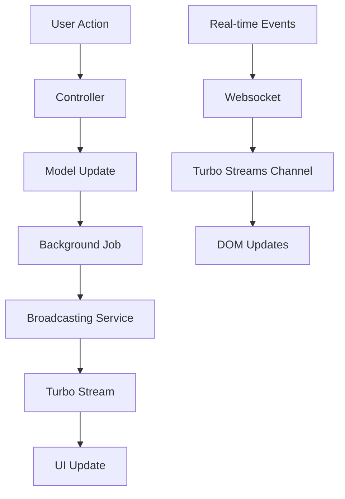

# 🏗️ UI/UX & Technical Architecture Guide

## 📋 Table of Contents
1. [User Flow Perspectives](#user-flow-perspectives)
2. [View Structure & Organization](#view-structure--organization)
3. [Turbo Streams & Broadcasting Architecture](#turbo-streams--broadcasting-architecture)
4. [Component Dependencies & Relationships](#component-dependencies--relationships)
5. [Real-time Update Flow](#real-time-update-flow)
6. [Performance & Optimization](#performance--optimization)

---

## 🎭 User Flow Perspectives

### 👤 Patient User Journey

#### **1. Prescription Request Flow**
```
New Message → Request Prescription → Payment → Awaiting Admin approval → Prescription Ready
```

**UI Components:**
- **Entry Point**: `messages/new.html.erb` (compose message)
- **Prescription Modal**: `prescriptions/partials/_lost_prescription_modal.html.erb`
- **Payment Processing**: Handled via background jobs + real-time updates
- **Status Tracking**: `prescriptions/index.html.erb` (main list)

#### **2. Message Management**
```
Inbox → Conversation View → Reply/Read Messages
```

**UI Components:**
- **Inbox**: `messages/inbox.html.erb` (received messages list)
- **Outbox**: `messages/outbox.html.erb` (sent messages list)
- **Conversation**: `messages/show.html.erb` (thread view)

### 👨‍⚕️ Admin User Journey

#### **1. Prescription Management Flow**
```
Inbox Notification → Conversation View → Generate & Send → Status Updates
```

**UI Components:**
- **Admin Inbox**: Same `messages/inbox.html.erb` with admin-specific features
- **Conversation Header**: `messages/show.html.erb` with "Generate & Send" button
- **Action Button**: `messages/partials/conversation/_prescription_action_button.html.erb`

#### **2. Real-time Monitoring**
```
Live Prescription Requests → Status Changes → Patient Notifications
```

---

## 📁 View Structure & Organization

### **Core Directory Structure**
```
app/views/
├── layouts/
│   └── application.html.erb           # Main layout with global notifications
├── messages/                          # Message management
│   ├── inbox.html.erb                # Patient/Admin inbox
│   ├── outbox.html.erb               # Sent messages
│   ├── show.html.erb                 # Conversation view
│   ├── new.html.erb                  # Compose message
│   └── partials/                     # Reusable components
│       ├── conversation/             # Conversation-specific partials
│       ├── list/                     # List item partials
│       └── forms/                    # Form-related partials
├── prescriptions/                     # Prescription management
│   ├── index.html.erb                # Patient prescription list
│   ├── partials/                     # Reusable components
│   └── *.turbo_stream.erb            # Real-time update templates
└── shared/                           # Global components
    ├── _flash_toast.html.erb         # Notification toasts
    ├── _pagination_nav.html.erb      # Pagination controls
    └── _pagination_info.html.erb     # Pagination info
```

### **Partial Organization Strategy**

#### **1. List Partials** (`messages/partials/list/`)
- **Purpose**: Render different message types in inbox/outbox
- **Key Files**:
  - `_received_message_item.html.erb` - Router for inbox messages
  - `_sent_message_item.html.erb` - Outbox message display
  - `_prescription_request_message_item.html.erb` - Special prescription messages

#### **2. Conversation Partials** (`messages/partials/conversation/`)
- **Purpose**: Components for conversation thread view
- **Key Files**:
  - `_thread.html.erb` - Message thread container
  - `_message.html.erb` - Individual message in conversation
  - `_prescription_action_button.html.erb` - Admin generate button
  - `_prescription_badge.html.erb` - Status badges

#### **3. Prescription Partials** (`prescriptions/partials/`)
- **Purpose**: Prescription-specific UI components
- **Key Files**:
  - `_list_content.html.erb` - Main prescription list with pagination
  - `_prescription_item.html.erb` - Individual prescription card
  - `_lost_prescription_modal.html.erb` - Request prescription modal
  - `_retry_confirmation_modal.html.erb` - Payment retry modal

---

## ⚡ Turbo Streams & Broadcasting Architecture

### **Broadcasting Services Hierarchy**

```
Broadcasting Module
├── TurboStreamsService           # Core broadcasting primitives
├── MessageDeliveryService        # New message broadcasts
├── MessageStatusService          # Read/unread status updates
├── InboxUpdatesService          # Unread counts & buttons
├── PrescriptionUpdatesService   # Prescription status & lists
└── PaginationUpdatesService     # Dynamic pagination updates
```

### **Stream Naming Conventions**

#### **1. User-Specific Streams**
```ruby
"inbox_#{inbox.id}"              # User's inbox updates
"user_#{user.id}_outbox"         # User's outbox updates
"user_#{user.id}_prescriptions"  # User's prescription list updates
```

#### **2. Conversation Streams**
```ruby
"conversation_#{message.id}"     # Specific conversation thread
```

#### **3. Global Streams**
```ruby
"messages"                       # General message broadcasts
"prescriptions"                  # Global prescription updates
```

### **Turbo Stream Targets**

#### **List Targets** (for append/prepend operations)
- `inbox-list` - Messages in inbox
- `outbox-list` - Messages in outbox
- `conversation-thread` - Messages in conversation
- `prescriptions-items` - Prescription list items

#### **Update Targets** (for replace operations)
- `prescription-action-button-#{id}` - Admin generate button
- `prescription-badge-#{id}` - Status badges in conversations
- `inbox_unread_count_#{id}` - Unread count displays
- `global-notifications` - Flash messages/toasts

### **Turbo Stream Templates**

#### **Immediate Response Templates** (Synchronous)
```
prescriptions/generate_success.turbo_stream.erb  # Button state + notification
prescriptions/create_success.turbo_stream.erb    # Success feedback
prescriptions/retry_success.turbo_stream.erb     # Retry feedback
```

#### **Background Job Templates** (Asynchronous via Broadcasting Services)
- List updates via `broadcast_prepend_to`
- Status updates via `broadcast_update_to`
- Count updates via `broadcast_replace_to`

---

## 🔗 Component Dependencies & Relationships

### **Data Flow Architecture**



### **Component Dependency Matrix**

#### **Messages System**
| Component | Depends On | Broadcasts To |
|-----------|------------|---------------|
| `messages/inbox.html.erb` | `_received_message_item` | `inbox-list` target |
| `messages/show.html.erb` | `_thread`, `_prescription_action_button` | `conversation-thread` |
| `_received_message_item` | `_prescription_request_message_item` | Message-specific partials |

#### **Prescriptions System**
| Component | Depends On | Broadcasts To |
|-----------|------------|---------------|
| `prescriptions/index.html.erb` | `_list_content` | `prescriptions-items` |
| `_prescription_item` | `_retry_confirmation_modal` | Item-specific targets |
| `_prescription_action_button` | Prescription status | Button-specific targets |

### **Critical Relationships**

#### **1. Message ↔ Prescription Relationship**
```ruby
# Database Level
Message.belongs_to :prescription, optional: true
Prescription.has_many :messages, dependent: :nullify

# View Logic
prescription_request_message?(message) # Helper method
find_prescription_from_message(message) # Helper method
```

#### **2. Broadcasting Dependencies**
```ruby
# Logical Order Enforcement
1. Message Creation Job (creates DB record)
2. Wait 0.5s (for message creation completion)
3. Status Update Job (broadcasts UI changes)
4. Pagination Update Job (updates counters)
```

#### **3. UI State Synchronization**
```ruby
# Consistent State Updates
Button State + Badge State + List State = Synchronized
```

---

## 🚀 Real-time Update Flow

### **Prescription Generation Flow**

#### **Step-by-Step Process:**
1. **User Clicks "Generate & Send"**
   ```
   Controller Action → Immediate Turbo Stream Response
   ├── Button → "Already Generated" (disabled)
   ├── Badge → Status updated
   └── Notification → "Generation started"
   ```

2. **Background Processing**
   ```
   PrescriptionGenerationJob.perform_later
   ├── Generate PDF
   ├── Create delivery message
   ├── Update prescription status
   └── Trigger broadcast with wait
   ```

3. **Delayed Broadcasting** (after message creation)
   ```
   BroadcastPrescriptionUpdateJob.perform_later
   ├── Update prescription list (patient view)
   ├── Update conversation button (admin view)
   ├── Update unread counts
   └── Show success notification
   ```

### **Payment Processing Flow**

#### **Step-by-Step Process:**
1. **Payment Submitted**
   ```
   PrescriptionPaymentJob.perform_later
   ├── Process payment via provider
   ├── Handle success/failure
   └── Broadcast results
   ```

2. **Success Path**
   ```
   1. Send admin notification (creates message)
   2. Wait for message creation
   3. Broadcast patient status update
   ```

3. **Failure Path**
   ```
   1. Mark payment as failed
   2. Show retry button
   3. Enable manual retry via modal
   ```

### **Message Delivery Flow**

#### **Real-time Broadcasting:**
```
New Message Created
├── Recipient Inbox (prepend to list)
├── Sender Outbox (prepend to list)
├── Conversation Thread (prepend to thread)
├── Unread Count Update
└── Pagination Update (background)
```

---

## ⚡ Performance & Optimization

### **Background Job Strategy**

#### **Immediate vs Delayed Broadcasting**
```ruby
# IMMEDIATE (Synchronous)
- Critical user feedback (button states)
- Error notifications
- Form validation results

# DELAYED (Asynchronous)
- List updates
- Count updates
- Non-critical notifications
- Pagination updates
```

#### **Job Batching Strategy**
```ruby
# GROUPED OPERATIONS
BroadcastPrescriptionUpdateJob
├── Prescription list update
├── Admin button update
├── Count badge update
├── Success notification
└── Pagination update

# LOGICAL ORDERING
wait_for_message_creation: true
├── Ensures message exists before status update
└── Prevents race conditions
```

### **Pagination Optimization**

#### **Dynamic Pagination Updates**
- **Limit**: 10 items per page (configured globally)
- **Strategy**: Background job updates for performance
- **Targets**: Separate navigation and info updates

#### **Stream Target Strategy**
```ruby
# EFFICIENT TARGETING
update_to    # Single element replacement
prepend_to   # Add to top of list (newest first)
append_to    # Add to bottom (rarely used)
replace_to   # Full element replacement
```

### **Broadcasting Performance Tips**

#### **1. Minimize Broadcast Frequency**
- Group related updates into single jobs
- Use background jobs for non-critical updates
- Batch operations where possible

#### **2. Targeted Updates**
- Specific element IDs for precise updates
- Avoid full page reloads
- Update only changed elements

#### **3. Smart Caching**
- Partial caching for expensive renders
- Database query optimization via includes
- Background job processing for heavy operations

---

## 🎯 Key Takeaways

### **Design Principles**
1. **User Experience First** - Immediate feedback for critical actions
2. **Performance Optimized** - Background processing for heavy operations
3. **Consistent State** - Synchronized UI across all views
4. **Logical Ordering** - Predictable sequence of updates
5. **Minimal Complexity** - Simple, maintainable architecture

### **Technical Excellence**
1. **Separation of Concerns** - Broadcasting services handle specific domains
2. **Reusable Components** - Partials for consistent UI elements
3. **Error Handling** - Graceful degradation and retry mechanisms
4. **Real-time Updates** - Seamless user experience via Turbo Streams
5. **Performance** - Optimized background job processing

### **Maintainability**
1. **Clear File Organization** - Logical directory structure
2. **Naming Conventions** - Consistent stream and target naming
3. **Documentation** - Self-documenting code with clear comments
4. **Testing Strategy** - Comprehensive coverage of user flows
5. **Monitoring** - Observable system behavior and performance

---

*This architecture ensures a robust, scalable, and maintainable messaging and prescription system with excellent user experience and technical performance.*
