# 🎭 User Flows & Process Documentation

## 📋 Table of Contents
1. [Overview & System Actors](#overview--system-actors)
2. [Patient User Flows](#patient-user-flows)
3. [Admin User Flows](#admin-user-flows)
4. [Doctor User Flows](#doctor-user-flows)
5. [Cross-Role Interactions](#cross-role-interactions)
6. [Technical Implementation Details](#technical-implementation-details)
7. [Error Handling & Edge Cases](#error-handling--edge-cases)

---

## 🎯 Overview & System Actors

### **System Roles**
- **👤 Patient**: Requests prescriptions, manages messages, tracks prescription status
- **👨‍⚕️ Admin**: Generates prescriptions, manages system, handles prescription requests
- **🩺 Doctor**: Communicates with patients, reviews cases (future expansion)

### **Core System Capabilities**
- **Messaging System**: Secure communication between all roles
- **Prescription Workflow**: Lost prescription replacement with payment processing
- **Real-time Updates**: Live status updates via Turbo Streams
- **Payment Processing**: Automated payment with retry mechanisms

---

## 👤 Patient User Flows

### **Flow 1: Lost Prescription Request**

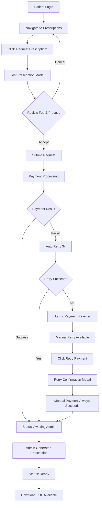

**Key UI Components:**
- **Entry Point**: `prescriptions/index.html.erb`
- **Request Modal**: `prescriptions/partials/_lost_prescription_modal.html.erb`
- **Retry Modal**: `prescriptions/partials/_retry_confirmation_modal.html.erb`
- **Status Display**: Real-time updates via Turbo Streams

### **Flow 2: Message Communication**

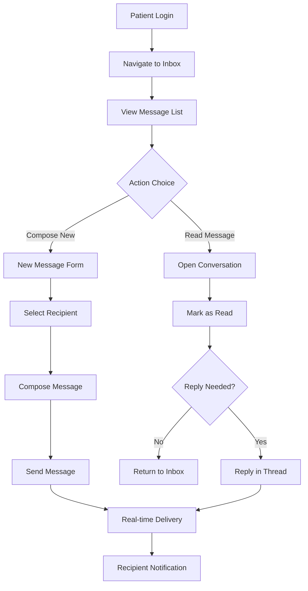

**Key Features:**
- **Inbox/Outbox**: Separate views for received/sent messages
- **Threading**: Conversation-based message organization
- **Real-time**: Live updates for new messages
- **Read Status**: Automatic read tracking

### **Flow 3: Prescription Status Monitoring**

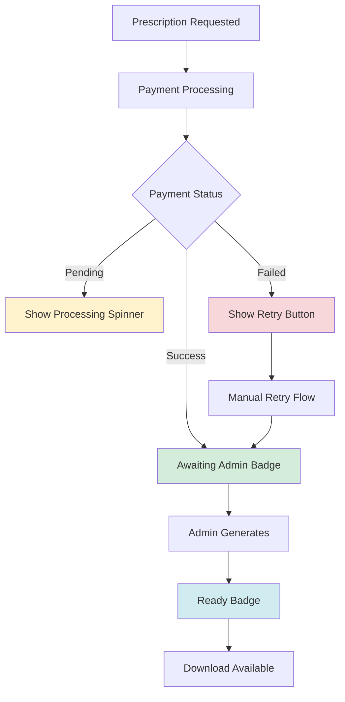

---

## 👨‍⚕️ Admin User Flows

### **Flow 1: Prescription Generation Workflow**

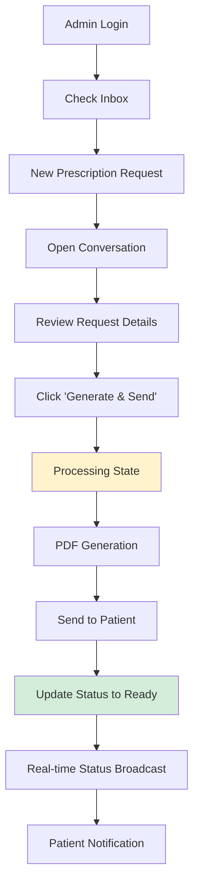

**Key Components:**
- **Admin Inbox**: Same interface with admin-specific features
- **Action Button**: `messages/partials/conversation/_prescription_action_button.html.erb`
- **Status Badge**: `messages/partials/conversation/_prescription_badge.html.erb`
- **Processing UI**: Spinner and status updates

### **Flow 2: System Monitoring**

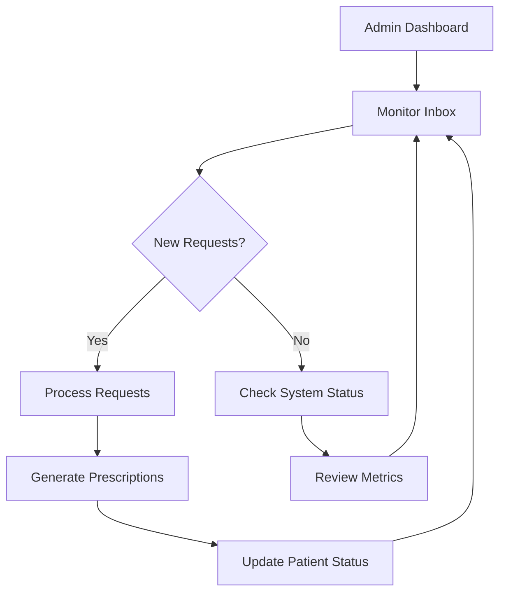

---

## 🩺 Doctor User Flows

### **Flow 1: Patient Communication**

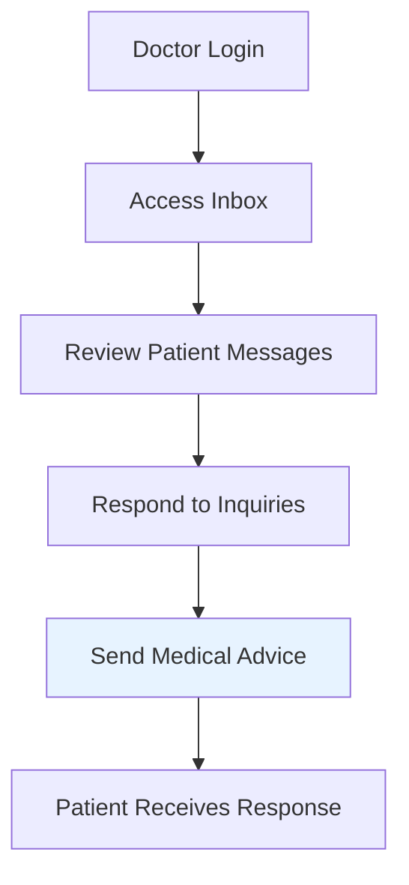

**Note**: Doctor role is currently implemented for future expansion with same messaging interface.

---

## 🔄 Cross-Role Interactions

### **Complete Prescription Lifecycle**

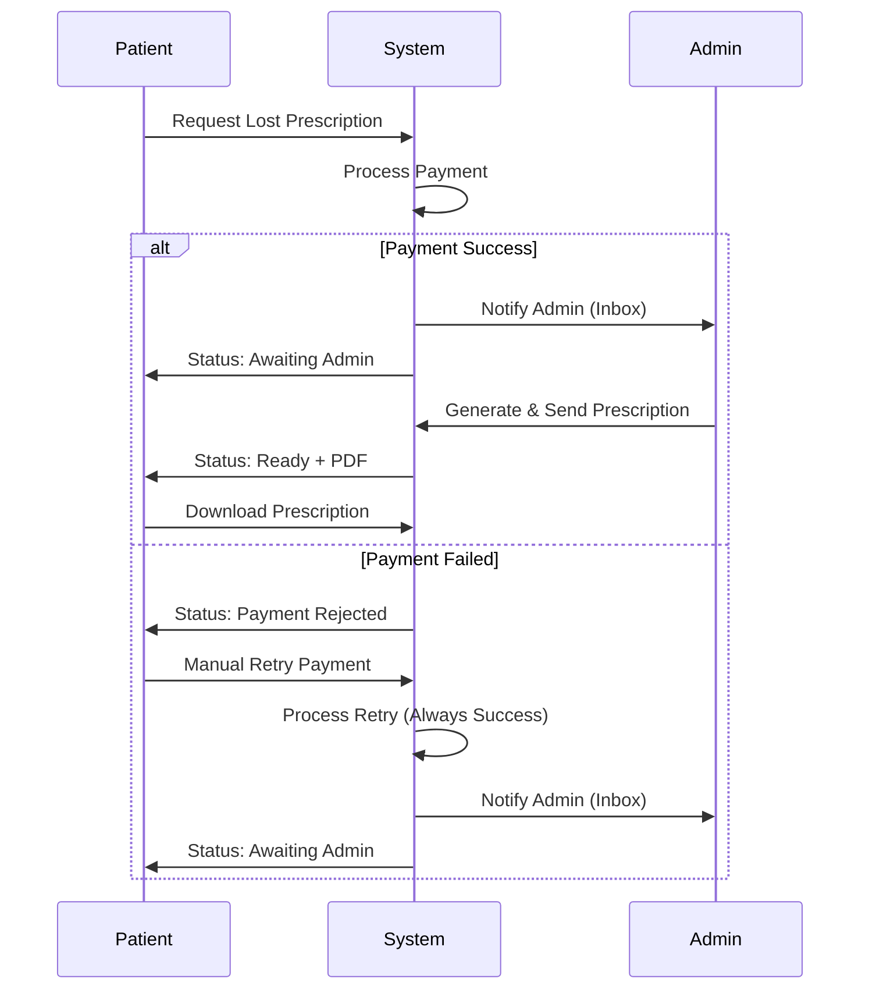

### **Real-time Communication Flow**

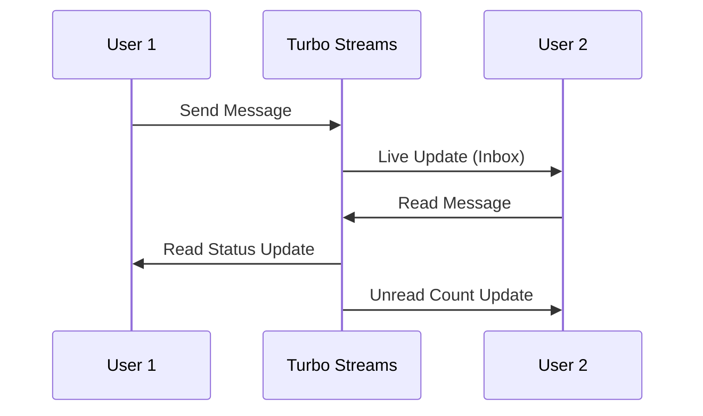

---

## ⚙️ Technical Implementation Details

### **Payment Processing Architecture**

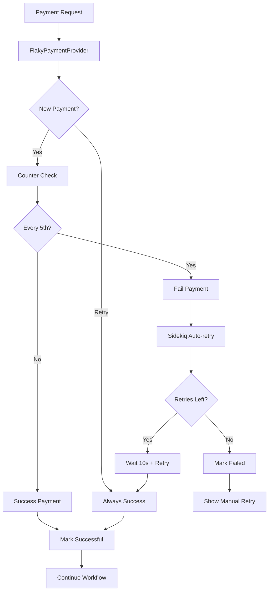

### **Broadcasting Strategy**

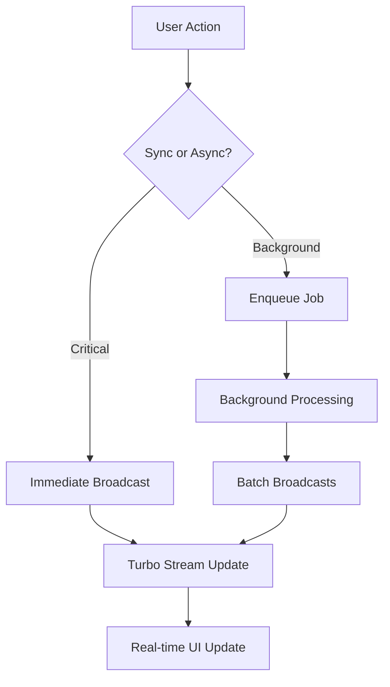

### **State Management**

| Prescription Status | Payment Status | UI Display | Available Actions |
|-------------------|----------------|------------|------------------|
| `requested` | `pending` | "Processing Payment..." + Spinner | None (auto-retry) |
| `requested` | `successful` | "Awaiting Admin" + Warning Badge | None |
| `payment_rejected` | `failed` | "Payment Failed" + Danger Badge | "Retry Payment" |
| `ready` | `successful` | "Ready" + Success Badge | "Download PDF" |

---

## 🚨 Error Handling & Edge Cases

### **Payment Failure Scenarios**

1. **Network Timeout**: Sidekiq auto-retry (3x, 10s intervals)
2. **Provider Error**: Same auto-retry mechanism
3. **All Retries Exhausted**: Manual retry button appears
4. **Manual Retry**: Always succeeds (business rule)

### **User Experience Patterns**

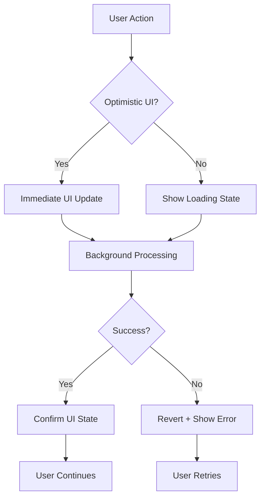

### **Data Consistency Patterns**

- **Optimistic Updates**: UI updates immediately, reverts on failure
- **Eventual Consistency**: Background jobs ensure data integrity
- **Conflict Resolution**: Last-write-wins for user actions
- **Audit Trail**: All state changes logged for debugging

---

## 🎯 Key Design Principles

### **User Experience**
- **Immediate Feedback**: Loading states and progress indicators
- **Clear Status**: Color-coded badges and descriptive text
- **Error Recovery**: Always provide next steps for users
- **Accessibility**: Proper ARIA labels and keyboard navigation

### **Technical Excellence**
- **Performance**: Optimized queries and background processing
- **Reliability**: Comprehensive error handling and retries
- **Scalability**: Efficient broadcasting and caching strategies
- **Maintainability**: Clean service architecture and separation of concerns

### **Business Logic**
- **Payment Security**: Retry mechanisms prevent lost revenue
- **Admin Efficiency**: Streamlined prescription generation workflow
- **Patient Satisfaction**: Clear status tracking and communication
- **System Integrity**: Consistent state management across all flows
